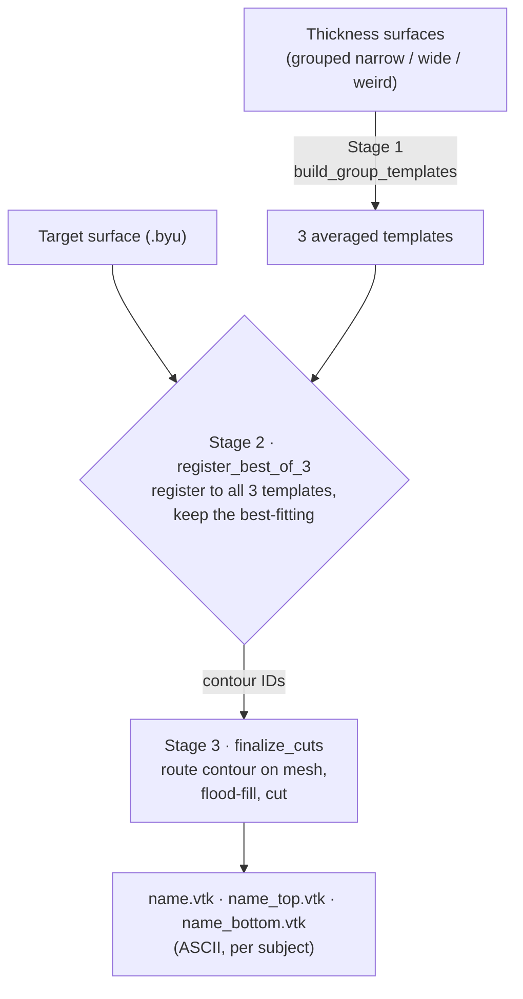

# MTL Surface Auto-Contour Pipeline

Automatically place the cutting contour on medial-temporal-lobe surfaces
(entorhinal / ERC+TEC) and split each surface into **top** and **bottom**
regions — replacing the manual contour tracing previously done by hand in
ParaView.

**Method:** shape-stratified **LDDMM template-boundary transfer**. Surfaces are
grouped by shape (narrow / wide / weird); one averaged template is built per
group; each new surface is registered to **all** group templates and the
best-fitting one is kept (best-of-3); that template's boundary is transferred
onto the surface and the surface is **cut along it, routed on the mesh**.

**Validation:** on 78 BIOCARD CON_LH surfaces, the automatic cut agreed with
manual hand cuts on a **median 93% of the surface** (mean 91%), with only **1/78
flagged** as a degenerate cut. The smaller side of each cut was 45–48%, matching
the 35–50% range measured across 198 manual cuts.

---

## Pipeline (3 stages)



```
 thickness surfaces (grouped narrow/wide/weird)
        │  [Stage 1: build_group_templates.py]  -- once per population+hemisphere
        ▼
 3 averaged templates (narrow/wide/weird)
        │
 target surface (.byu)
        │  [Stage 2: register_best_of_3.py]  -- register to all 3, keep best fit
        ▼
 <name>_contour_ids.txt
        │  [Stage 3: finalize_cuts.py]  -- route on mesh, flood-fill, cut
        ▼
 <name>.vtk   <name>_top.vtk   <name>_bottom.vtk   (ASCII, per subject)
```

Stages 1–2 need `py-lddmm` (run on a cluster/GPU). Stage 3 is pure numpy/scipy
and runs anywhere; it is robust to a slightly loose registration because the
contour is re-routed along the mesh edges.

---

## Repository contents

```
scripts/
  build_group_templates.py   Stage 1: averaged LDDMM template per shape group
  register_best_of_3.py      Stage 2: register surface to all templates, keep most-balanced
  finalize_cuts.py           Stage 3: cut into top/bottom; clean ASCII VTK per subject
  ContourMappings.py         single-template variant (one template, no best-of-3)
  cut_from_contour.py        simpler cut variant (.byu output; superseded by finalize_cuts.py)
  contour_diagnostics.py     QC: feature-separation AUC + atlas-transfer feasibility
docs/
  ENVIRONMENT.md             exact py-lddmm environment recipe (the setup that works)
```

(No data files are included — surfaces/templates stay on the JHU system.)

---

## Usage

Run Stages 1–2 on the cluster in the py-lddmm env, inside `screen`/`nohup`
(both are slow on CPU; a GPU cuts it ~100x — keops uses it automatically).

**Stage 1 — build the 3 templates** (once per population + hemisphere; merges
folders with the same shape name, so CON + MCI pool automatically):
```bash
python3 build_group_templates.py templates_BIOCARD_LH \
  LH_CON_thickness/narrow LH_CON_thickness/wide LH_CON_thickness/weird \
  LH_MCI_thickness/narrow LH_MCI_thickness/wide LH_MCI_thickness/weird
```

**Stage 2 — register each surface to best-of-3:**
```bash
python3 register_best_of_3.py templates_BIOCARD_LH \
  '/path/to/byu_tests/CON_LH/cut/*.byu' best_CON_LH
```
Logs `OK <name> best=narrow/wide/weird balance=NN%` per surface.

**Stage 3 — cut into top/bottom (fast):**
```bash
python3 finalize_cuts.py byu_tests/CON_LH best_CON_LH final_CON_LH
```
Output (ASCII VTK), grouped by subject:
```
final_CON_LH/
└── BEIALE/
    ├── BEIALE_150428_7.vtk          (original surface)
    ├── BEIALE_150428_7_top.vtk
    ├── BEIALE_150428_7_bottom.vtk
    └── ...
```

---

## Design notes (why it works)

- **Shape-stratified templates.** A single template averaging very different
  shapes is "blurry" and registers poorly to extreme surfaces (that caused
  sliver cuts). Per-shape templates each register well; best-of-3 picks the
  closest. *All* surfaces in a group are used to build its average.
- **Surface-based, not subject-based.** Each surface is matched independently,
  so a subject's timepoints can match different groups as the shape atrophies
  over time.
- **Match population & hemisphere.** Use BIOCARD templates on BIOCARD, ADNI on
  ADNI; keep LH and RH separate (mirror images). Don't mix — it widens the
  per-template variance the grouping is meant to reduce.
- **Balance guard (data-grounded).** Real hand cuts have a smaller side of
  35–50% (median 43%, over 198 cuts). `finalize_cuts.py` flags any cut whose
  smaller side is < 35% as `SUSPECT` (likely a failed registration), and
  `register_best_of_3.py` selects the most-balanced template per surface.
- **Geometric top/bottom.** Labels are assigned by geometry (region with the
  higher centroid along the axis of greatest separation = "top"), so they are
  consistent across surfaces. Flip `TOP_IS_HIGHER` in `finalize_cuts.py` if your
  convention is opposite.

---

## Results (validation vs manual cuts)

Auto cuts compared to expert hand cuts on the BIOCARD CON_LH set. Agreement =
fraction of the surface assigned to the same side as the manual cut (label-flip
invariant).

| Metric | Value |
|---|---|
| Surfaces compared (BIOCARD CON_LH) | 78 |
| Median agreement with manual cut | **93%** |
| Mean agreement | 91% |
| 90% of cases above | ~85% |
| Auto cut smaller-side balance | 45–48% (manual: 35–50%) |
| Flagged degenerate (`SUSPECT`) | 1 / 78 |

The single flagged case and a handful of lower-agreement subjects (e.g. BIRBAR,
some SCHJAN) are the candidates for review/manual touch-up.

## Environment & compute

- See [`docs/ENVIRONMENT.md`](docs/ENVIRONMENT.md) for the exact py-lddmm setup
  (uses the older py-lddmm; `pyfftw==0.13.1`, `pykeops==2.1.2`, `meshpy`; template
  building stubs out `pygalmesh`).
- CPU timing: template build ≈ ~15 h per set; registration ≈ ~25 min/surface
  (best-of-3). A GPU node (keops auto-detects CUDA) reduces this by ~100x with
  no code changes — strongly recommended for full batches.

---

## Credits

LDDMM registration: `py-lddmm` by Laurent Younes (JHU). Pipeline (shape-stratified
template transfer, best-of-3 selection, on-mesh cutting) and validation by
Jiabei Li. Distributed under BSD-3-Clause (see `LICENSE`).
